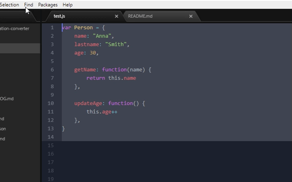

# JS object notation converter

An atom package that converts the syntax between object literal notation and function statement notation (sometimes called constructor).



Normally, when you convert a JS object you need to complete two steps:
1. Convert the syntax (e.g. convert equals signs to colons)
2. Convert legal code in one notation that is illegal in the other

This package helps with the tedious work of the first step by automating it. The decisions of the second step still needs to be done manually by you.

## How to
1. Select the object you want converted
2. Press <kbd>ctrl-alt-o</kbd> (win/linux) / <kbd>cmd-alt-o</kbd> (mac)

or

1. Select the object you want converted
2. Then press <kbd>shift-ctrl-p</kbd> (win) / <kbd>shift-cmd-p</kbd> (mac) / <kbd>ctrl-shift-p</kbd> (linux) to open the atom command palette
3. Start typing <code>"js-object-notation-converter:convert"</code>
4. Select the command from the list of choices
4. Press <kbd>Enter</kbd> to execute

Additionally, you can access the convert command through the <code>Packages</code> option in the menu bar, or the text editor's contextmenu.


## Install

#### In Atom Editor
Install the package through the Atom Editor itself:

1. Open Atom, or click the green <kbd style="border-radius: 4px; border: #68A672; color: #ffffff; background: #68A672; padding: 5px; display: inline;">Install</kbd> button at the top of [this page](https://atom.io/packages/js-object-notation-converter)
2. Click <code>File</code> in the menubar at the top in Atom
3. Click <code>Settings</code> in the dropdown menu or press <kbd>ctrl-,</kbd> (win/linux) / <kbd>cmd-,</kbd> (mac)
4. Select <code>Install</code> in the left menu
5. Type <code>"js-object-notation-converter"</code> in the input field
6. Find the package in the results and click <kbd style="border-radius: 4px; border: #68A672; padding: 5px;color: #ffffff; background: #007acc; display: inline;">Install</kbd>

#### Command Line
1. Install [Atom](https://atom.io/)

2. In your terminal of choice, type:

    ```shell
    apm install js-object-notation-converter
    ```

    to install the latest version.


## NB!
This package will **not auto-correct** syntax for you. If the syntax is wrong, the output will (most likely), be wrong also.

As mentioned above, code that is legal in one notation, but not the other (e.g. comparison expressions in the objects root scope), will be ignored. You must manually decide what to do with this code. This package only converts syntax.

The exception to the above is **private functions** which will be made public in the "constructor -> literal" conversion (thats how object literals work after all).

``` js
function calc() {}   ->   calc: function() {}
```

(NB! running the conversion again after converting from constructor to literal will not make previous private functions private again - use <kbd>ctrl-z</kbd> (undo) instead; to achieve this.)
